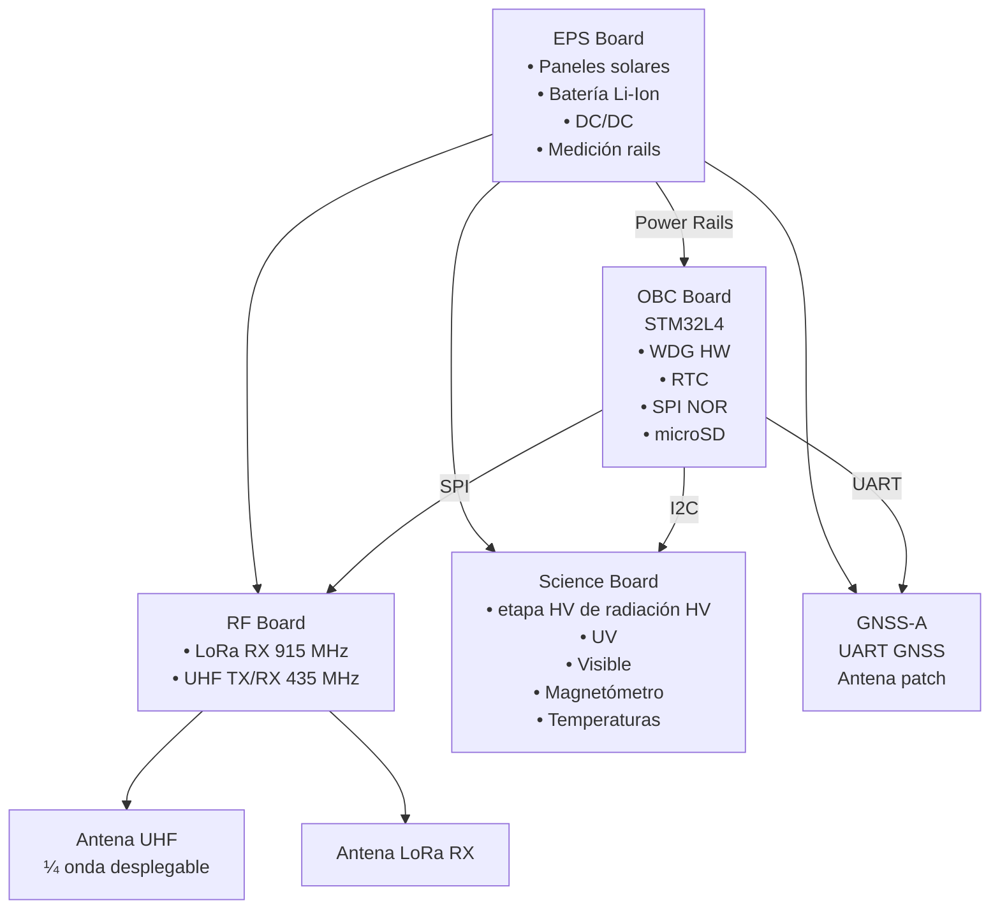
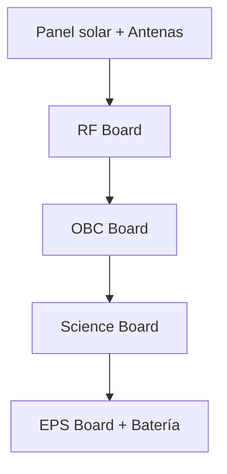

# MVP v2.0 — Consolidado integral

## Estado
- **Tipo:** consolidación documental sin cambios técnicos nuevos.
- **Regla de precedencia aplicada:** en caso de contradicción, prevalecen las versiones más nuevas y anexos de `v1.4` sobre `v1.3`, `v1.1` y `v1`.
- **Objetivo:** agregar toda la información histórica sin omisiones, manteniendo decisiones técnicas existentes.

## Fuentes consolidadas (orden de precedencia)
1. `MVP v1.md`
2. `MVP v1.1.md`
3. `MVP v1.3.md`
4. `MVP v1.4.md`
5. `MVP v1.4 - EPS Sizing.md`
6. `MVP v1.4 - Power Budget.md`
7. `MVP v1.4 - Block Diagram.md`

## Decisiones vigentes (canónicas en v2.0)
- La arquitectura de misión se mantiene en **store & forward** para el MVP.
- El payload IoT mantiene foco en **uplink LoRa (RX satelital)** y downlink satélite→tierra por enlace dedicado del segmento espacial/terreno definido en los documentos v1.x.
- El baseline técnico vigente para integración de subsistemas es el de **v1.4 + anexos de EPS, power budget e ICD/block diagram**.
- No se introducen cambios de alcance, banda, potencia, hardware o CONOPS respecto de los documentos fuente; sólo se consolidan.

---


## Anexo de integración de banco (telemetría 433 MHz)
- Se incorporó un banco de pruebas RF 433 MHz para validar telemetría IMU y pipeline de logging CSV en tierra.
- Alcance: **solo laboratorio** (no reemplaza decisiones de banda/enlace orbital del MVP).
- Implementación: `05_Software/embedded/esp32_s3_tx_telemetry/telemetry_tx.ino` y `05_Software/embedded/uno_rx_logger/rx_logger.ino`.
- Configuración/build: `05_Software/embedded/platformio.ini` y `05_Software/embedded/scripts/*`.
- ADR asociado: `08_Decisions/ADR-20260212-telemetry-bench-433mhz.md`.
- Riesgos/costos de escalado: **TBD** hasta cerrar pruebas de banco.
- Ground segment software: `05_Software/GroundTelemetryDashboard/` para monitoreo en tiempo real de telemetría CSV (estado: MVP banco, visualización aproximada de actitud).

---

## Cuerpo consolidado (transcripción íntegra de predecesores)

> Nota: para garantizar agregación completa sin pérdida de contenido, se incluye la transcripción completa de cada documento fuente. Ante divergencias, aplicar siempre la precedencia indicada arriba.


# ===== INICIO FUENTE: 00_MVP/MVP v1.md =====

# Documento Técnico — MVP v1

## Nanosat IoT Experimental (LoRa Uplink + Downlink Satélite-a-Tierra probado)

**Versión:** 1.0 (MVP)
**Alcance:** prueba de conectividad + aprendizaje operativo orbital.
**Restricción clave:** **NO** se realiza downlink satélite→nodos IoT en esta etapa para minimizar riesgo regulatorio.

---

## 0) Objetivos y criterio de éxito

### Objetivo principal

Validar una cadena completa de comunicaciones y operación:

**Nodo (Buenos Aires) → Satélite (LoRa uplink) → Estación terrena (downlink sat) → Backend (decode + logging).**

### “Éxito MVP” (mínimo)

1. Recepción en el satélite de al menos **N ≥ 10** paquetes uplink LoRa provenientes de nodos en BA.
2. Descarga a la estación terrena de esos paquetes + **métricas RF por paquete**.
3. Evidencia reproducible: logs firmados con timestamp, RSSI/SNR/CFO, y correlación con ventana de pasada.

### “Éxito MVP+”

* Operación estable ≥ 30 días.
* > 70% de paquetes recibidos por pasada (con configuración robusta).
* Tablero de telemetría/operación con trending.

---

## 1) Concepto de misión

### Modo de servicio (por diseño)

**Store & Forward**: el satélite escucha uplinks durante cada pasada y almacena; luego baja a tu estación terrena cuando tiene enlace.

> No hay servicio continuo con un único satélite en LEO; el “servicio” es por ventanas de pasada.

---

## 2) Órbita recomendada y justificación

### Parámetros objetivo (MVP)

* **Órbita:** LEO circular
* **Altitud:** **500–600 km**
* **Inclinación:** **50–60°** (prioridad: cobertura BA + flexibilidad/costo)
  **o** **SSO ~97°** (prioridad: estándar nanosat + operaciones + acceso)

**Justificación técnica:**

* 500–600 km reduce drag vs VLEO y facilita vida útil.
* Footprint y duración de pasada adecuados para múltiples intentos diarios.
* El Doppler en LEO no se elimina “con órbita”; se gestiona con diseño RF/PHY y medición (se instrumenta CFO/Doppler).

### Nota sobre proveedor de inserción

TLON Space publicita inserción orbital dedicada para nanosats (“pick your orbit…”), alineada con el perfil del MVP (LEO). ([Tlon][1])

---

## 3) Arquitectura del sistema (segmentos)

### 3.1 Segmento Usuario (Nodos LoRa en Buenos Aires)

**Cantidad inicial:** 1–10 nodos

**Requisitos mínimos del nodo:**

* Banda: **915–928 MHz** (plan AU915 o configuración equivalente)
* TX: potencia típica del módulo (sin amplificadores en MVP)
* Antena: ¼ onda real / dipolo con ROE razonable
* Payload: 12–40 bytes
* Periodicidad: 30–120 s **solo durante ventana estimada de pasada** (para no inundar el canal)

**Regulación terrestre Argentina:** 915–928 MHz se encuadra en bandas “compartidas/sin autorización individual”, bajo Resolución 581/2018 y parámetros ENACOM (p.ej. 4653/2019). ([Enacom][2])

---

### 3.2 Segmento Espacial (Satélite)

**Plataforma sugerida:** 3U–6U CubeSat (recomendación: 3U si el bus lo permite; 6U si necesitás márgenes de potencia y antenas)

#### Payload IoT (Uplink LoRa – Receive Only)

* Receptor LoRa (915) con:

  * logging de **RSSI, SNR, CFO**, timestamp (GNSS si existe), CRC ok/fail
  * modos configurables SF/BW/CR (tabla en §6)
  * buffer local para ≥ 10.000 mensajes

**Importante:** el payload LoRa es **solo receptor** en MVP para minimizar riesgos regulatorios (no transmitís ISM desde órbita).

#### Telecom de downlink (Satélite → Estación terrena)

Acá hay que ser preciso con tu pedido: **en espacio no existe “banda sin regulación”**; lo que sí existe es **banda y equipamiento altamente probado** con un marco de acceso relativamente alcanzable: el **Servicio de Aficionados por Satélite (Amateur-Satellite Service)**, típicamente en **UHF 435–438 MHz** (y a veces VHF 145.8–146).
Esto está masivamente probado en CubeSats, con coordinación IARU. ([AMSAT-UK][3])

**Opción recomendada para MVP (probada en CubeSat):**

* **Downlink UHF 435–438 MHz**, modulación robusta (FSK/GMSK/BPSK), 1k2–9k6 bps inicialmente.
* Coordinación de frecuencias por **IARU** (proceso estándar) para evitar conflictos y operar ordenadamente en asignaciones de aficionados por satélite. ([AMSAT-UK][3])

**Marco argentino (amateur):** ENACOM gestiona licencias y reglamentos de radioaficionados; existe normativa y listados vigentes. ([Enacom][4])

> Nota realista: operar en bandas de aficionados no significa “sin permiso”; significa que el camino de coordinación/uso suele ser más accesible que una asignación comercial, pero requiere cumplir reglas del servicio (no uso comercial, identificaciones, etc.).

#### OBC/EPS/ADCS (mínimo viable)

* **OBC** con watchdog + almacenamiento (MMC/flash) + RTC.
* **EPS** con MPPT, batería Li-ion, medición de corrientes/voltajes por rail.
* **ADCS** mínimo: magnetómetro + magnetorquers (coarse), suficiente para estabilizar y mejorar patrón de antena.
* **Thermal** pasivo + sensores.

---

### 3.3 Segmento Terreno (Estación terrena en Buenos Aires)

**Arquitectura recomendada (mínimo viable):**

* Antena UHF direccional (yagi/cross-yagi) + LNA + SDR/receptor
* Seguimiento:

  * MVP: seguimiento manual asistido (software de tracking + rotor opcional)
  * Ideal: rotor az/el
* Decodificación:

  * demod + FEC + framing
* Backend:

  * ingesta de paquetes, base de datos, dashboard, export

---

## 4) Protocolo y flujo de datos

### 4.1 Uplink LoRa (nodo → satélite)

* Usar LoRa PHY (no necesariamente LoRaWAN completo en MVP).
* Paquete con:

  * NodeID (4–8 bytes)
  * seq
  * payload corto
  * CRC
* Sin downlink al nodo (esta etapa).

### 4.2 Downlink satélite → ground (UHF)

* Enlace “telemetría + store&forward”
* Tramas con:

  * header + sat timestamp
  * housekeeping
  * bloque de mensajes LoRa recibidos (con métricas RF)
  * CRC/FEC
* Planificar “dump windows” en pasadas con mejor elevación.

---

## 5) Telemetría y medición (obligatorio del MVP)

### 5.1 Métricas RF por paquete LoRa recibido

* RSSI
* SNR
* CFO (offset de frecuencia) y/o estimación Doppler
* SF/BW/CR
* Timestamp (ideal GNSS)
* Estado CRC

### 5.2 Telemetría satélite (housekeeping)

* Voltajes/corrientes por rail
* Estado batería (SOC estimado)
* Temperaturas críticas
* Estado ADCS (modo, tasas)
* Contadores:

  * pkts LoRa rx ok/fail
  * bytes almacenados
  * bytes downlink exitosos
  * resets/watchdog

### 5.3 Telemetría estación terrena

* SNR downlink por trama
* tasa de frames OK/fail
* espectro/ruido de fondo en UHF durante pasadas
* logs de tracking

---

## 6) Configuración RF LoRa (MVP: robustez > throughput)

### Recomendación de perfiles (para probar y medir)

Definir 3 “modes” conmutables por comando desde tierra (no desde nodos):

* **Modo R (Robusto):** SF alto, BW medio, payload mínimo
  Objetivo: primer contacto, tolerancia a enlace débil.
* **Modo B (Balance):** SF medio, BW medio, payload medio
  Objetivo: compromiso éxito/tiempo-en-aire.
* **Modo E (Experimental):** variaciones para caracterizar Doppler/interferencia
  Objetivo: dataset para fase 2.

> La selección exacta (SF/BW/CR) se fija con un mini link budget y pruebas terrestres/estratosféricas. En el MVP v1 no “bloqueo” valores sin tu presupuesto de potencia/antena y target de tasa.

---

## 7) Plan de pruebas por fases (para reducir riesgo antes de órbita)

### Fase 0 — Banco (laboratorio)

* Nodo → receptor LoRa en movimiento simulado (offsets de frecuencia)
* Downlink UHF en banco: loopback, BER básico

### Fase 1 — Campo

* Ensayos a larga distancia en BA / alrededores
* Perfil de interferencia en 915 y UHF

### Fase 2 — “Pseudo-orbital” (opcional pero muy valiosa)

* Globo estratosférico / avión / dron alto (si es viable)
* Objetivo: validar geometría + tracking + pipeline operativo

### Fase 3 — Operación orbital (MVP)

* Primera semana: sólo housekeeping y downlink estable
* Semana 2: habilitar escucha LoRa y colecta
* Semana 3+: iteración de perfiles R/B/E

---

## 8) Riesgos y mitigaciones

### R1 — Regulatorio (espacial)

* **Riesgo:** uso ISM desde órbita (TX) complica; mitigado porque MVP LoRa es RX-only.
* **Riesgo:** downlink en UHF amateur requiere coordinación IARU y cumplimiento de reglas del servicio. ([AMSAT-UK][3])

**Mitigación:** operar el downlink en asignaciones amateur con coordinación IARU + encuadre ENACOM (licencia/club/estación). ([Enacom][4])

### R2 — Enlace (uplink LoRa)

* **Riesgo:** SNR insuficiente en uplink.
  **Mitigación:** modo robusto + antenas correctas + baja tasa + limitar nodos.

### R3 — Operación (ground segment)

* **Riesgo:** estación terrena insuficiente (tracking, LNA, RFI).
  **Mitigación:** comenzar con downlink simple y robusto; priorizar elevaciones altas.

### R4 — Complejidad del satélite

* **Riesgo:** 1 satélite = 1 oportunidad.
  **Mitigación:** minimizar “novedad” en downlink, maximizar logging.

---

## 9) Entregables del MVP v1 (lo que deberías producir como “pack”)

1. **ICD** (interface control doc) Nodo↔Sat (payload) y Sat↔Ground
2. Diseño de tramas (uplink LoRa, downlink UHF)
3. Plan de operación (CONOPS) por semana
4. Esquema de telemetría + dashboard
5. Checklist de coordinación/licencias (IARU + ENACOM)
6. Plan de pruebas (Fase 0→3) con criterios de aceptación

---

## 10) Decisiones cerradas en este MVP v1

* **No** downlink a nodos en 915 (evitamos TX ISM desde órbita en MVP).
* Downlink sat→tierra usando banda **amateur-sat** (UHF 435–438) por ser el estándar de CubeSats y con coordinación IARU ampliamente establecida. ([CubeSatShop.com][5])
* Uplink IoT LoRa en 915–928 desde nodos en BA, bajo el marco de uso compartido terrestre. ([Argentina][6])

---

## Anexo A — Nota sobre TLON (encaje de inserción)

TLON Space declara “Dedicated Orbital Insertion” para nanosats, lo que calza con un MVP que necesita elegir órbita LEO práctica. ([Tlon][1])

---

# ===== FIN FUENTE: 00_MVP/MVP v1.md =====


# ===== INICIO FUENTE: 00_MVP/MVP v1.1.md =====

# Documento Técnico — MVP v1.1 (1U / DIY / Arduino-compatible)

## 1) Objetivo (no cambia)

**Demostrar conexión end-to-end** y capturar métricas para iterar:

* **Nodo BA (LoRa 915) → Satélite (RX only) → Estación terrena (UHF downlink) → Backend**

**Criterio de éxito mínimo:**

* ≥10 paquetes LoRa recibidos en satélite y bajados a tierra con **RSSI/SNR/CFO/timestamp**.

---

## 2) Restricciones 1U (las que mandan el diseño)

En 1U vas a estar limitado por:

* **Potencia promedio** (típico 1–2 W promedio realista sin magia).
* **Antenas** (necesitás desplegable sí o sí para UHF eficiente).
* **Tiempo de radio** (downlink corto por pasada y tasa baja).
* **Robustez** (Arduino “de maker” funciona en banco, pero en órbita necesitás watchdog, brownout, memoria con ECC si se puede, y tolerancia a resets).

**Decisión clave MVP:** simplicidad extrema y telemetría exhaustiva.

---

## 3) Órbita y operación (ajustada al uplink LoRa)

**Órbita objetivo:** LEO 500–600 km (misma recomendación)

**Operación para maximizar uplink LoRa:**

* Definir un **umbral de elevación** para “ventana útil” (ej. solo transmitir cuando la pasada esté por encima de 20–30°).
  Esto te da 2 ventajas: baja el FSPL y suele mejorar geometría/antena.
* Los nodos transmiten **cada 30–120 s** solo dentro de ventana útil.
* El satélite escucha “siempre que puede” (o por schedule para ahorrar).

---

## 4) Arquitectura 1U (bloques y componentes sugeridos)

### 4.1 OBC (Arduino-compatible, pero serio)

Recomendación práctica: **MCU ARM** con core Arduino, no AVR.

* **SAMD51** (Arduino-compatible) o **STM32** (Arduino core)
* **Watchdog independiente** (ideal externo) + supervisor de tensión (brownout real)
* Almacenamiento: **microSD industrial** o **SPI NOR flash** + journaling simple
* RTC + (ideal) **GNSS** si el presupuesto lo permite (para timestamp real)

### 4.2 Payload LoRa (RX only)

* Chip tipo **SX1276/78** (LoRa clásico) o equivalente.
* Antena RX 915:

  * En 1U, una opción viable: **monopolo desplegable corto / dipolo simple** (aunque sea RX).
  * Si no desplegás, igual podés recibir, pero perdés margen y estabilidad.

**Métricas obligatorias por paquete:**

* RSSI, SNR, **CFO** (offset de frecuencia, proxy Doppler), CRC, timestamp.

### 4.3 Downlink UHF (satélite → estación)

* En 1U DIY, lo más pragmático:

  * **UHF 435 MHz** (enfoque satélite de aficionados), baja tasa (1k2 a 9k6).
  * Transceptor basado en chip tipo **Si4463** / **CC1120** / módulo UHF similar.
* Antena UHF:

  * **Cinta métrica** (tape-measure monopole) desplegable es lo más usado por CubeSats por simplicidad.
  * Un monopolo ¼ de onda en 435 MHz es ~17 cm: entra desplegado.

> Nota: aunque sea “banda típica”, **no es “sin regulación”**; lo “probado” acá significa *ecosistema y práctica*. En MVP te conviene tratar el downlink como “radioaficionado por satélite” (cumpliendo reglas) o, si más adelante querés comercial, cambiar el esquema.

### 4.4 EPS (potencia) minimalista

* Paneles: en 1U, probablemente 2–4 caras útiles + (si se puede) deployables (pero complica).
* Batería: Li-ion con BMS adecuado.
* MPPT (ideal) o al menos cargador eficiente.
* Medición: V/I batería, V/I panel, V/I rails.

### 4.5 ADCS mínimo (opcional pero recomendable)

* Magnetómetro + magnetorquers.
* Aunque sea “coarse”, te mejora:

  * estabilidad de enlace UHF
  * consistencia de patrón de antena
  * interpretación de datos RF

---

## 5) Estación terrena 100% DIY (pero efectiva)

Para que el MVP funcione, **la estación vale tanto como el satélite**.

**Recomendado:**

* Antena UHF direccional: **cross-yagi** (10–14 dBi típico) o yagi simple con polarización ajustable.
* **LNA** cerca de antena + buen coaxial.
* Receptor: **SDR** (RTL-SDR como mínimo, ideal uno con mejor rango dinámico) + demod software.
* Tracking:

  * MVP: manual con predicción de pasadas.
  * Ideal: rotor az/el (DIY con motores + control).

---

## 6) Link budget preliminar (con supuestos explícitos)

### 6.1 Downlink UHF 435 MHz (sat → ground) — **muy viable**

**Supuestos:**

* TX satélite: 1 W (30 dBm) *o incluso 100 mW (20 dBm)*
* G_tx sat: 0 dBi (monopolo)
* G_rx ground: 12 dBi (yagi/cross-yagi)
* Pérdidas: 3 dB (cables, mismatch, pointing imperfecto)
* Distancia slant:

  * buena elevación: ~600 km
  * baja elevación: ~2000 km

**FSPL (aprox):**

* 435 MHz @ 600 km: **140.8 dB**
* 435 MHz @ 2000 km: **151.2 dB**

**Potencia recibida (aprox):**

* Caso bueno (600 km, 1 W):
  P_rx ≈ 30 + 0 + 12 − 140.8 − 3 = **−101.8 dBm**
* Caso malo (2000 km, 100 mW):
  P_rx ≈ 20 + 0 + 12 − 151.2 − 3 = **−122.2 dBm**

Eso es compatible con enlaces de baja tasa bien diseñados (1k2/9k6) con buenas cadenas RF.
**Conclusión:** downlink UHF es el camino correcto para el MVP.

---

### 6.2 Uplink LoRa 915 MHz (nodo → sat, RX only) — **viable si restringís geometría**

**Supuestos realistas MVP:**

* TX nodo: 20 dBm (módulos LoRa 915 típicos)
* G_tx nodo: 0 dBi (antena simple)
* G_rx sat: +2 a +3 dBi si la antena es decente (o 0 dBi si muy básica)
* Pérdidas: 3 dB
* Distancias:

  * buena elevación: ~600–1200 km
  * baja elevación: ~2000 km

**FSPL:**

* 915 MHz @ 600 km: **147.2 dB**
* 915 MHz @ 1200 km: **153.3 dB**
* 915 MHz @ 2000 km: **157.7 dB**

**P_rx ejemplo con G_rx sat=3 dBi:**

* 600 km: 20 + 0 + 3 − 147.2 − 3 = **−127.2 dBm**
* 1200 km: 20 + 0 + 3 − 153.3 − 3 = **−133.3 dBm**
* 2000 km: 20 + 0 + 3 − 157.7 − 3 = **−137.7 dBm**

LoRa en modos robustos puede detectar cerca de ~−137 dBm (depende BW/SF/implementación).
**Conclusión:** para que el uplink sea “confiable”, tu regla operativa debe ser:

* **Transmitir solo en pasadas con elevación razonable** (no apurar baja elevación).
* Empezar con **modos muy robustos**.

---

## 7) Tabla de modos LoRa recomendados (MVP)

La idea: arrancar con robustez, medir CFO/Doppler real y luego optimizar.

| Modo                     |      BW |    SF | Uso                                   | Pros                    | Contras            |
| ------------------------ | ------: | ----: | ------------------------------------- | ----------------------- | ------------------ |
| R1 (Ultra robusto)       | 125 kHz |    12 | primer contacto, elevación media/alta | máximo alcance          | time-on-air alto   |
| R2 (Robusto)             | 125 kHz |    11 | operación normal MVP                  | buen margen             | time-on-air alto   |
| B1 (Balance)             | 125 kHz |    10 | si R2 va sobrado                      | más throughput          | menos margen       |
| E (Experimental Doppler) | 250 kHz | 10–11 | medir tolerancia CFO                  | más tolerancia a offset | menor sensibilidad |

**Regla MVP:** arrancás con **R1/R2**, guardás CFO/SNR por paquete, y después pasás a B1/E cuando tengas datos.

---

## 8) Tramas y almacenamiento (simple pero auditables)

### 8.1 Uplink LoRa (nodo → sat)

Payload sugerido (ejemplo):

* NodeID (4B)
* Seq (2B)
* Timestamp nodo (4B opcional)
* Data (hasta 20–30B)
* CRC (LoRa lo aporta, pero podés agregar app-CRC)

### 8.2 Registro en satélite (por paquete)

* sat_time (GNSS/RTC)
* NodeID, seq
* RSSI, SNR, CFO
* config mode (SF/BW)
* CRC ok/fail

### 8.3 Downlink UHF (sat → ground)

* Housekeeping + lote de mensajes LoRa + checksums
* Enviar “resumen” primero (cuántos paquetes, rango tiempos), luego “dump” completo.

---

## 9) Plan de desarrollo DIY (Arduino-first → PCB)

### Etapa A — prototipo (100% dev kits)

* MCU Arduino-compatible + LoRa RX module + UHF module + sensores EPS
* Simular “pasada”:

  * variar frecuencia (CFO)
  * mover antenas
  * probar pipeline end-to-end con ground station

### Etapa B — prototipo integrado (stack de PCBs)

* 2–3 placas apiladas:

  1. EPS
  2. OBC + storage
  3. RF (LoRa RX + UHF TX) + filtros/duplex si aplica

### Etapa C — flight candidate 1U

* componentes seleccionados por temperatura y vibración
* conectores mínimos
* harness corto
* plan de “reset seguro” (watchdog + fallback firmware)

---

## 10) Riesgos específicos de “Arduino en el espacio” (y cómo mitigarlos)

* **Radiación / SEU / latch-up**: vas a tener resets.
  → Mitigación: watchdog, firmware idempotente, logs, “safe mode” UHF.
* **microSD corrupta**:
  → Mitigación: journaling simple, doble archivo, o SPI NOR.
* **RFI interna**:
  → Mitigación: buen layout RF, planos de masa, filtrado en EPS.
* **Antena deploy** falla:
  → Mitigación: mecanismo ultra simple, test de despliegue repetido, redundancia si cabe.

---

# Decisiones cerradas (v1.1)

* Satélite **1U**.
* Payload LoRa **solo RX** (915).
* Downlink a tierra por **UHF** (probado para CubeSats), estación DIY direccional.
* Estrategia uplink: **ventanas de elevación** + modos LoRa robustos + medición CFO/SNR.

---

# ===== FIN FUENTE: 00_MVP/MVP v1.1.md =====


# ===== INICIO FUENTE: 00_MVP/MVP v1.3.md =====

# Documento Técnico — MVP v1.3

## 1.5U DIY Nanosat: LoRa Uplink RX-Only + UHF Downlink 1k2 + Science Payload + GNSS-A

**Versión:** 1.3
**Prioridad:** robustez, recuperabilidad, telemetría rica
**Estrategia regulatoria MVP:** no transmitir ISM desde órbita (LoRa RX-only); downlink por UHF tipo amateur-sat (requiere coordinación/encuadre).

---

## 1) Requisitos (nivel sistema)

### R1 — Conectividad mínima

* Recibir paquetes LoRa 915–928 MHz desde 1–10 nodos en Buenos Aires (RX-only).
* Bajar a tierra esos paquetes + métricas RF por paquete mediante UHF 435 MHz a 1200 bps.

### R2 — Instrumentación científica mínima (Science Pack)

* Radiación ionizante: etapa HV de radiación CPS/CPM (con HV controlado).
* UV: UVA/UVB (I2C).
* Contexto: luz visible, magnetómetro 3 ejes, temperaturas multipunto (≥4).

### R3 — Tiempo y posición

* GNSS-A: receptor GNSS por UART + antena patch (best-effort).
* RTC con respaldo (batería/supercap).
* Operación tolerante a GNSS-fail (todo sigue funcionando con RTC).

---

## 2) Arquitectura por segmentos

### 2.1 Nodos terrestres (Buenos Aires)

* LoRa 915–928 (AU915 o equivalente).
* TX 20 dBm típico; antena ¼ onda o dipolo.
* Operación por ventanas de pasada (preprogramado por horario).

### 2.2 Segmento espacial (1.5U)

**Masa/volumen objetivo:** 1.5U (10×10×15 cm).

**Stack recomendado (4 PCBs):**

1. EPS Board
2. OBC Board (STM32 + RTC + storage + watchdog)
3. RF Board (LoRa RX + UHF TX/RX + front-end)
4. Science Board (etapa HV de radiación HV + UV + light + mag + temps)

### 2.3 Estación terrena DIY (Buenos Aires)

* Antena direccional UHF (yagi/cross-yagi), LNA en mástil, SDR/radio.
* Tracking manual asistido (MVP) o rotor az/el (ideal).
* Backend: demod + decod frames + DB + dashboard.

---

## 3) Selección de plataforma OBC (STM32 Arduino-compatible)

### 3.1 Familia recomendada (para v1.3)

* **STM32L4** (bajo consumo, suficiente potencia) **o** **STM32F4/F7** (más performance, más consumo).
  Para robustez-first en 1.5U, sugiero **STM32L4** salvo que necesites DSP/SDR (no es el caso).

### 3.2 Reglas de robustez (hard requirements)

* Watchdog **hardware** activado siempre.
* Brownout real (supervisor) + reset limpio.
* “Safe mode” por defecto tras reset.
* Logs idempotentes (no perder integridad si se reinicia durante escritura).

---

## 4) Telecomunicaciones

### 4.1 Uplink IoT (LoRa RX-only, 915–928)

**Modos cerrados (MVP):**

* R1: BW 125 kHz, SF12
* R2: BW 125 kHz, SF11
* E: BW 250 kHz, SF10–11 (solo para medición Doppler/CFO cuando R2 funcione)

**Métricas por paquete:**

* RSSI, SNR, CFO, CRC, timestamp sat, mode_id.

### 4.2 Downlink (UHF 435 MHz, 1200 bps, robusto)

* Modulación: AFSK/FSK robusta (1k2) + CRC por frame.
* Beacon periódico + dump con reanudación.

> Nota regulatoria: amateur-sat es “muy probado” pero no es “sin regulación”; requiere coordinación/encuadre.

---

## 5) GNSS-A + RTC (tolerante a GNSS-fail)

### 5.1 GNSS-A (best-effort)

* GNSS UART a OBC (sentencias NMEA o binario).
* Antena patch (montaje con plano de masa y clear view lo mejor posible en 1.5U).
* GNSS aporta:

  * timestamp absoluto preciso
  * (si disponible) posición/velocidad para correlación ciencia y enlace

### 5.2 RTC (obligatorio)

* RTC con cristal + respaldo.
* RTC es “source of truth” cuando GNSS no fija.

### 5.3 Política de sincronización tiempo

* Si GNSS Fix válido:

  * ajustar RTC (slew/step según criterio)
  * marcar `time_source = GNSS`
* Si GNSS no Fix:

  * usar RTC, marcar `time_source = RTC`
* Telemetría siempre incluye:

  * `time_source`, `rtc_drift_est` (estimado), `last_gnss_fix_age`

---

## 6) Science Payload Pack (Arduino-compatible)

### 6.1 etapa HV de radiación (radiación ionizante)

* Módulo HV + tubo etapa HV de radiación con salida TTL (pulsos).
* Contador por hardware (timer/counter) → CPS/CPM.
* HV controlado:

  * OFF por defecto
  * ON por ventanas programadas
  * medición de corriente HV para diagnóstico

### 6.2 UV

* VEML6075 (I2C): UVA/UVB + flags.

### 6.3 Luz visible

* Fotodiodo/ALS (I2C o analógico).

### 6.4 Magnetómetro 3 ejes

* I2C/SPI.

### 6.5 Temperaturas multipunto

* ≥4 sensores: batería, EPS, RF, Science.

---

## 7) Buses y asignación (topología)

**I2C-A (science bus):** UV + magnetómetro + ALS + temps digitales
**SPI-A (RF):** LoRa transceiver
**UART-A:** GNSS
**UART-B:** UHF modem / control (o SPI si el módulo lo requiere)
**SDIO/SPI-B:** storage (microSD industrial o SPI NOR)

**Hardware counter input:** etapa HV de radiación pulse line

**Regla:** RF y HV lejos de DC/DC; masas y retornos controlados; filtros LC para HV.

---

## 8) Modelo de datos y tramas (compacto, 1k2)

### 8.1 Tipos de tramas UHF

1. **BEACON** (cada 10–20 s)
2. **STATUS_EXT** (bajo demanda)
3. **SCI_SUMMARY** (periódico, cada 10 s en SCIENCE MODE)
4. **LORA_LOG** (dump de registros LoRa recibidos)
5. **EOT** (fin de transmisión)
6. **ACK/NACK** (control de reanudación)

### 8.2 BEACON (objetivo: “siempre llega”)

Campos mínimos:

* sat_time (RTC)
* time_source (GNSS/RTC)
* battery_v, battery_i, temp_batt
* mode (SAFE/SCI/DL)
* logs_pending (lora_count, sci_count)
* last_reset_reason

### 8.3 SCI_SUMMARY (cada 10 s)

Campos:

* sat_time
* geiger_cps (u16) + optional cpm (u16 cada 60 s)
* uva, uvb (u16,u16)
* light (u16)
* mag_xyz (i16×3) (o cada 30 s)
* temps[4] (i16×4, deci-°C)
* flags (hv_on, gnss_fix, eclipse_est, etc.)

### 8.4 LORA_LOG (por registro)

Registro fijo (32–40 bytes):

* sat_time (u32)
* node_id (u32)
* seq (u16)
* rssi_x10 (i16)
* snr_x10 (i16)
* cfo_hz (i16)
* mode_id (u8)
* flags (u8)
* payload_len (u8)
* payload (0..24)

### 8.5 Reanudación robusta (idempotencia)

* Cada frame tiene `frame_index`.
* Ground envía `ACK(last_ok_index)`.
* Satélite reanuda desde `last_ok_index + 1`.

---

## 9) CONOPS (operación por modos)

### 9.1 SAFE MODE (default tras reset)

* UHF beacon ON
* Housekeeping básico
* HV OFF
* LoRa RX OFF
* GNSS ON best-effort (puede duty-cycle si consumo)

### 9.2 SCIENCE MODE (programado)

* HV ON por ventanas (ej. 10 min ON / 20 min OFF)
* SCI_SUMMARY cada 10 s
* LoRa RX ON solo en ventanas de pasadas previstas (para ahorrar y reducir interferencias)

### 9.3 DOWNLINK WINDOW

* Beacon más frecuente (ej. cada 10 s)
* DUMP: primero STATUS_EXT + SCI_SUMMARY backlog + luego LORA_LOG
* Política: solo hacer dump en pasadas de elevación alta.

---

## 10) Plan de pruebas (Fases 0–3) + criterios de aceptación

### Fase 0 — Banco

**A0.1:** Downlink UHF 1k2 loopback con BER aceptable
**A0.2:** Contador etapa HV de radiación no pierde pulsos a CPS esperado
**A0.3:** Logging idempotente: cortar energía en escritura sin corromper

**Aceptación:** 24 h de ejecución continua con resets inducidos y recuperación.

### Fase 1 — Campo

**A1.1:** Estación terrena recibe beacon a distancia (pruebas horizontales)
**A1.2:** Medición RFI: 915 y UHF con SDR

**Aceptación:** beacon decodificado ≥95% en ventana de test.

### Fase 2 — Pseudo-orbital (recomendado)

Globo/avión (si viable):

* Validar tracking, pipeline, y datasets de science.

**Aceptación:** dump de logs completo en movimiento + correlación de tiempos.

### Fase 3 — Órbita

**Semana 1:** solo beacon + housekeeping estable
**Semana 2:** science windows + dumps
**Semana 3:** habilitar LoRa RX y colecta

**Aceptación MVP:** ≥10 paquetes LoRa recibidos y bajados con métricas + science summary consistente 7 días.

---

## 11) Lista corta de decisiones de implementación (para pasar a diseño eléctrico)

* OBC: STM32L4 Arduino-core (baseline)
* Storage: SPI NOR para logs críticos + microSD opcional para bulk
* GNSS: módulo UART + patch (best-effort)
* UHF: 1k2 robusto + framing corto + ARQ simple
* HV etapa HV de radiación: enable + medición corriente + schedule

---

## 12) Riesgos y mitigaciones (actualizado)

* **GNSS no fija:** sistema opera con RTC; logs marcados con `time_source`.
* **HV EMI afecta RF:** HV duty-cycle + filtros + separación física.
* **Downlink débil:** 1k2 + frames cortos + yagi + LNA.
* **Resets por SEU:** safe-mode default + comandos idempotentes + reanudación.

---

## Referencias de soporte (mínimas)

* Dimensiones 1.5U:
* Coordinación amateur-sat/IARU (principio):

---

# ===== FIN FUENTE: 00_MVP/MVP v1.3.md =====


# ===== INICIO FUENTE: 00_MVP/MVP v1.4.md =====

# Documento Técnico — MVP v1.4 (CONSOLIDADO)

## Nanosatélite DIY Experimental 1.5U
**LoRa Uplink RX‑Only + UHF Downlink 1k2 + Science Pack + GNSS‑A**

**Versión:** 1.4 (baseline única y vigente)

---

## Regla de consolidación aplicada
Esta versión **1.4** consolida **MVP v1 → v1.1 → v1.3** bajo la siguiente jerarquía obligatoria:

- **v1.3 > v1.2 > v1.1 > v1**
- Toda decisión explícita en una versión superior **prevalece**.
- Ningún requisito, restricción u objetivo definido en versiones previas se pierde:
  - Si no entra en conflicto, **se incorpora**.
  - Si entra en conflicto, **se documenta y se resuelve** a favor de la versión superior.

El presente documento es el **único documento válido** para avanzar con el MVP.

---

## 0) Objetivo del MVP (conservado y reforzado)

### Objetivo principal (v1)
Demostrar una cadena **end‑to‑end real orbital**:

**Nodo terrestre (Buenos Aires, LoRa) → Satélite (RX) → Estación terrena (UHF) → Backend**

### Criterio de éxito mínimo (NO negociable)

1. Recepción en órbita de **≥10 paquetes LoRa** originados en Buenos Aires.
2. Descarga a tierra de esos paquetes vía **UHF 435 MHz ~1200 bps**.
3. Cada paquete debe incluir:
   - Timestamp
   - RSSI
   - SNR
   - CFO
   - CRC / integridad
4. Evidencia reproducible: logs persistentes + correlación con pasadas orbitales.

### Criterio de éxito extendido (MVP+ heredado)

- Operación estable ≥30 días
- >70 % de paquetes válidos por pasada
- Dashboard de telemetría histórica

---

## 1) Concepto de misión (CONOPS)

### Modo de servicio

**Store & Forward por ventanas orbitales**

- No existe servicio continuo (LEO + 1 satélite).
- Operación estricta por **ventanas de elevación**.

### Modos de operación (v1.3)

1. **SAFE MODE**
   - Beacon mínimo
   - Housekeeping
   - Consumo ultra bajo

2. **SCIENCE MODE**
   - Muestreo Science Pack
   - Logging persistente

3. **DOWNLINK WINDOW MODE**
   - Dump priorizado de datos
   - ARQ simple

Arranque **siempre en SAFE MODE** tras reset.

---

## 2) Decisiones de arquitectura BLOQUEADAS

### Form factor (decisión final)

- ❌ 1U (descartado por márgenes)
- ✅ **1.5U (10×10×15 cm)** — decisión heredada de v1.3

Justificación:
- Márgenes de potencia
- Separación EMI
- Inclusión Science Pack + GNSS
- Recuperabilidad

### Estrategia regulatoria (v1 + v1.3)

- **LoRa 915–928 MHz: RX‑ONLY en órbita**
- **No ISM TX desde espacio** en MVP
- Downlink por **UHF 435 MHz tipo amateur‑sat** (requiere coordinación/licencia)

---

## 3) Órbita objetivo

- Tipo: **LEO circular**
- Altitud: **500–600 km**
- Inclinación: compatible con múltiples pasadas sobre Buenos Aires

Órbita seleccionada para:
- Maximizar link budget uplink
- Vida orbital razonable
- Complejidad operativa baja

---

## 4) Segmento terrestre (heredado y ampliado)

### Nodos IoT (Buenos Aires)

- LoRa 915–928 MHz (AU915 o equivalente)
- TX típico: 20 dBm
- Antena: ¼ onda o dipolo
- Transmisión **solo dentro de ventana de pasada**
- Periodo: 30–120 s

### Estación terrena

- Antena UHF direccional (Yagi / Cross‑Yagi)
- LNA en mástil
- SDR o radio dedicado
- Decoder + backend + almacenamiento

---

## 5) Segmento espacial — arquitectura 1.5U

### Stack de subsistemas (bloqueado)

1. **EPS Board**
   - Paneles solares
   - Batería Li‑Ion
   - Reguladores DC/DC
   - Medición de rails

2. **OBC Board**
   - MCU: **STM32L4** (bajo consumo)
   - Watchdog HW externo
   - RTC con respaldo
   - Storage:
     - SPI NOR (logs críticos)
     - microSD industrial (bulk, tolerante a corrupción)

3. **RF Board**
   - LoRa RX 915 MHz
   - UHF TX/RX 435 MHz
   - Framing + ARQ simple
   - Filtros + aislamiento EMI

4. **Science Board (Science Pack)**
   - etapa HV de radiación (HV controlado)
   - Sensor UV (UVA/UVB)
   - Luz visible
   - Magnetómetro 3 ejes
   - ≥4 sensores de temperatura

5. **GNSS‑A**
   - Receptor GNSS UART
   - Antena patch
   - Best‑effort, no crítico

---

## 6) Antenas (decisiones heredadas)

- **UHF 435 MHz:**
  - Monopolo ¼ onda (~17 cm)
  - Desplegable (tipo cinta)

- **LoRa RX 915 MHz:**
  - Monopolo o dipolo simple

---

## 7) Presupuestos de diseño (obligatorios)

### Link Budget

- Downlink UHF 1k2 validado como viable
- Uplink LoRa viable con:
  - Elevación >20–30°
  - SF11–SF12
  - BW 125 kHz

### Power Budget

- SAFE MODE dominante
- Science + Downlink solo en ventanas
- Reset tolerante y frecuente asumido

---

## 8) Software de vuelo — principios obligatorios

- Boot determinista → SAFE MODE
- Logs idempotentes
- Tolerancia a reset/brownout
- Scheduler por ventanas
- GNSS opcional, nunca bloqueante

### Tramas mínimas

- BEACON
- SCIENCE_SUMMARY
- LORA_LOG
- ACK/NACK

Todas con CRC y numeración.

---

## 9) Plan de pruebas (V&V)

1. Banco:
   - Loopback UHF
   - Cortes de energía
   - Stress de storage

2. Campo:
   - Enlaces horizontales
   - Simulación de pasadas

3. Orbital:
   - Semana 1: solo beacon
   - Semana 2+: ciencia + LoRa RX

---

## 10) Estado del documento

- ✅ Todas las decisiones de v1, v1.1 y v1.3 preservadas
- ✅ Conflictos resueltos según jerarquía indicada
- ✅ Science Pack incluido
- ✅ 1.5U bloqueado

**Este documento habilita directamente:**
- Diseño eléctrico
- Block diagram final
- Firmware base
- Plan de estación terrena

---

**FIN — MVP v1.4**

# ===== FIN FUENTE: 00_MVP/MVP v1.4.md =====


# ===== INICIO FUENTE: 00_MVP/MVP v1.4 - EPS Sizing.md =====

# MVP v1.4 — A2) EPS Sizing (Paneles + Batería + MPPT)

**Baseline:** depende de **MVP v1.4 — Power Budget** (A). Este documento fija **targets numéricos** para dimensionar EPS (Electrical Power System) del satélite **1.5U**.

> Nota: Esto es dimensionamiento **de ingeniería**. Los consumos/potencias deben validarse en banco y luego se recalcula.

---

## 0) Inputs fijos (del budget A)

### 0.1 Perfil orbital de cálculo
- Periodo: **90 min**
- Sol / eclipse: **60 / 30 min**

### 0.2 Casos de operación a cubrir
- **Caso TÍPICO (recomendado):** SAFE 80 min + DOWNLINK 10 min → **0.55 Wh/orbita**
- **Caso SCI continuo:** SCI 90 min → **0.915 Wh/orbita**

### 0.3 Objetivos de diseño de potencia
- Potencia disponible en sol objetivo (ya inferido en A): **≥ 1.2 W netos** (en condiciones nominales) para tener margen.

---

## 1) Dimensionamiento de batería (Wh)

### 1.1 Requisito mínimo por eclipse
En eclipse (30 min) no hay generación solar.

Si el satélite cae a SAFE en eclipse:
- P_SAFE_avg ≈ **0.193 W**
- E_eclipse_SAFE = 0.193 W × 0.5 h = **0.0965 Wh**

Si el satélite hace SCI en eclipse (NO recomendado como baseline):
- P_SCI_avg ≈ **0.610 W**
- E_eclipse_SCI = 0.610 × 0.5 = **0.305 Wh**

**Regla bloqueada:** en eclipse, por defecto **SAFE** o SCI muy limitado.

### 1.2 Requisito por picos (UHF TX y HV)
La batería debe sostener:
- Picos de UHF TX (eléctricos) + cargas simultáneas
- Eventuales escrituras microSD

**Regla:** durante DOWNLINK window, **HV OFF** y Science OFF (recomendado) para evitar picos simultáneos.

### 1.3 Margen de batería (degradación + temperatura + DoD)
Para que el sistema sea robusto:
- No diseñar para descargar más de **30–40%** por órbita en nominal.
- Considerar degradación y cold-soak.

### 1.4 Target de capacidad (resultado)
Se recomienda que la batería permita al menos:
- **4 eclipses SAFE** consecutivos sin carga útil (escenario de emergencia)

E_4eclipses_SAFE = 4 × 0.0965 ≈ **0.386 Wh**

Aplicando margen ×3 (DoD + degradación + picos + envejecimiento):
- **Batería target ≥ 1.2 Wh útiles**

Si apuntás a SCI más agresivo:
- **Batería target ≥ 3 Wh útiles**

✅ **Recomendación MVP (1.5U):** diseñar para **~6–10 Wh** nominales de batería.
- Esto es intencionalmente conservador y te da margen real para picos, envejecimiento y ventanas extendidas.

> En práctica: 2× celdas Li-ion en paralelo (según formato) suele entrar cómodo en 1.5U, pero el layout manda.

---

## 2) Dimensionamiento de paneles solares (W)

### 2.1 Fórmula de potencia neta disponible

\[ P_{net} = P_{EOL} \times \eta_{EPS} \]

Donde:
- **P_EOL**: potencia de paneles al **End Of Life** (degradados)
- **η_EPS**: eficiencia neta (MPPT + DC/DC + cableado + pérdidas) — asumí **0.75–0.85** como rango de ingeniería.

### 2.2 Restricción geométrica (1.5U)
- Cuerpo: **10×10×15 cm**
- Caras típicas disponibles: 4 laterales + 2 bases
- Se puede usar panel **body-mounted** y/o **deployables**.

### 2.3 Modelo simple de potencia orbital
La energía generada por órbita:

\[ E_{gen} = P_{net,sol} \times t_{sol} \]

Con t_sol = 1 h.

Para ser energy-positive:

\[ P_{net,sol} \ge E_{load/orb} / 1h \]

Entonces:
- Caso TÍPICO: E_load = 0.55 Wh → **P_net,sol ≥ 0.55 W**
- Caso SCI full: E_load = 0.915 Wh → **P_net,sol ≥ 0.915 W**

Aplicando margen operativo (apuntamiento imperfecto + eclipses extendidos + degradación):
- **Target P_net,sol ≥ 1.2 W** (bloqueado como objetivo de diseño)

### 2.4 Qué significa eso en paneles (heurística)
Si tu EPS neto es 80% (0.8):

\[ P_{EOL,sol} \ge 1.2 / 0.8 = 1.5 W \]

Y si querés margen adicional:
- Diseñar para **~2.0 W EOL** en sol.

✅ **Recomendación MVP:** apuntar a **2–3 W BOL** (Beginning Of Life) efectivos en sol, para que EOL siga >1.5–2 W.

---

## 3) MPPT vs PWM (decisión de arquitectura EPS)

### 3.1 Requisito mínimo
- Debe existir control de carga seguro para Li-ion (CC/CV), protección y medición.

### 3.2 Recomendación
- **MPPT (Maximum Power Point Tracking)** es preferible si:
  - Usás deployables
  - Querés maximizar energía en actitudes pobres
  - Querés margen en invierno térmico

- PWM es aceptable si:
  - Paneles modestos
  - Margen grande de área

✅ Para 1.5U con ciencia + downlink: **MPPT recomendado**.

---

## 4) Regulación de potencia (DC/DC) y rails

### 4.1 Topología recomendada
- VBAT (Li-ion) → buck a 3V3_OBC always-on
- VBAT → buck a 3V3_RF (switchable)
- VBAT → buck/boost a 5V_AUX (switchable) para HV/GNSS si aplica

### 4.2 Reglas de integridad
- Separar **3V3_RF** de **3V3_SCI** (ruido + EMI)
- Soft-start en rails switchables
- Medición de corriente por rail (ideal) o por shunt multiplexado

---

## 5) Sizing por corriente pico (peor caso)

### 5.1 Peor caso permitido (por regla)
Durante DOWNLINK:
- UHF TX ON
- UHF RX ON
- OBC ON
- RF rail ON
- Science OFF
- HV OFF

Potencia aproximada (de A):
- ~1.74 W durante ventana (promedio)
- Picos podrían ser mayores si el PA tiene ramp-up o si la corriente de TX es pulsada.

### 5.2 Target de capacidad de entrega
- Dimensionar rail RF y batería para **≥3×** la potencia promedio de downlink durante pulsos.

✅ Target de potencia pico soportable (eléctrico): **~5 W** durante segundos.

Esto evita brownouts si:
- el PA consume más de lo presupuestado
- se producen escrituras simultáneas

---

## 6) Energy Balance recomendado (por órbita)

### 6.1 Caso típico con target 1.2 W net en sol
- Energía generada: 1.2 W × 1 h = **1.2 Wh**
- Energía consumida: **0.55 Wh**

Margen por órbita: **+0.65 Wh** (carga batería + margen térmico)

### 6.2 Caso SCI full con 1.2 W net
- Energía consumida: **0.915 Wh**
- Margen: **+0.285 Wh**

Esto permite SCI sostenida si no hay eventos raros.

---

## 7) Reglas de operación energética (bloqueadas para firmware)

1) **Eclipse = SAFE por defecto** (salvo comando explícito + energía alta)
2) DOWNLINK solo si:
   - VBAT > umbral
   - Temperatura batería en rango
   - Estimación de SOC en E2/E3
3) HV etapa HV de radiación:
   - Nunca durante TX UHF
   - Duty-cycle máximo (baseline): 10m ON / 20m OFF
4) microSD:
   - Preferir en sol
   - En eclipse solo logs críticos en NOR

---

## 8) Checklist de verificación en banco (para cerrar números)

### 8.1 Medidas mínimas
- Corriente real UHF TX (a potencia configurada)
- Corriente real LoRa RX
- Corriente HV etapa HV de radiación (on/off)
- Consumo OBC en sleep/run
- Eficiencia DC/DC (bajo carga real)

### 8.2 Prueba de robustez EPS
- Simular brownouts + resets
- Activar TX en el peor punto de VBAT
- Verificar que PGOOD + supervisor no generen oscilación

---

## 9) Targets finales (para que el diseño no divague)

### Batería
- **Capacidad nominal objetivo:** **6–10 Wh**
- **Útil asegurada:** ≥3 Wh (para margen real)

### Solar
- **P_net en sol objetivo:** **≥1.2 W**
- **P_EOL en sol objetivo:** **≥1.5–2.0 W** (según eficiencia)

### EPS
- MPPT recomendado
- Rails medidos + switchables
- Soportar **pico ~5 W** sin brownout

---

**FIN — EPS Sizing A2 (MVP v1.4)**

# ===== FIN FUENTE: 00_MVP/MVP v1.4 - EPS Sizing.md =====


# ===== INICIO FUENTE: 00_MVP/MVP v1.4 - Power Budget.md =====

# MVP v1.4 — Power Budget + estados de consumo (EPS bloqueado)

**Baseline:** MVP v1.4 consolidado (deriva de v1/v1.1/v1.3). fileciteturn1file2 fileciteturn1file0 fileciteturn1file1

**Propósito:** fijar un **presupuesto de potencia** utilizable para dimensionamiento de EPS y para firmware (duty-cycles por modo). Este documento **bloquea**:
- Operación por modos SAFE / SCIENCE / DOWNLINK WINDOW. fileciteturn1file1
- LoRa **RX-only** en 915–928 MHz, operación por ventanas. fileciteturn1file2 fileciteturn1file1
- Downlink UHF 435 MHz **~1200 bps** con tramas cortas y reanudación. fileciteturn1file1
- Science Pack mínimo (etapa HV de radiación HV + UV + visible + mag + temps). fileciteturn1file1
- GNSS-A best-effort + RTC como fuente primaria cuando no hay fix. fileciteturn1file1

---

## 0) Convenciones y supuestos (diseño preliminar)

### 0.1 Unidades
- Potencia en **W** (watts)
- Corriente en **mA**
- Energía en **Wh/orbita**

### 0.2 Perfil orbital para cálculo (supuesto de ingeniería)
- **Periodo orbital:** 90 min
- **Iluminación:** 60 min sol / 30 min eclipse (≈ 67/33)

> Nota: esto varía con altitud/inclinación/β-angle; sirve como baseline para dimensionar margen.

### 0.3 Filosofía de dimensionamiento
- Se diseña para que el satélite sea **energy-positive** con SAFE MODE dominante.
- SCIENCE y DOWNLINK se programan para no agotar batería (gobernados por SOC/voltaje/temperatura).
- Los valores de consumo son **estimaciones de diseño**: se deben reemplazar por mediciones en banco en la Fase 0. fileciteturn1file1

---

## 1) EPS bloqueado — rails, mediciones y control

### 1.1 Rails obligatorios (bloqueados)
| Rail | Tensión | Tipo | Encendido | Medición |
|---|---:|---|---|---|
| 3V3_OBC | 3.3V | always-on | Siempre | V/I |
| 3V3_RF | 3.3V | switchable | Por modo | V/I |
| 3V3_SCI | 3.3V | switchable | Por modo | V/I |
| 5V_AUX | 5.0V | switchable | Por modo | V/I |
| VBAT | batería | always | Siempre | V/I, temp |

### 1.2 Señales EPS → OBC (bloqueadas)
| Señal | Tipo | Función |
|---|---|---|
| PGOOD | GPIO/INT | Power-good / brownout supervisor |
| VBAT_SENSE | ADC | Telemetría batería |
| ISOLAR_SENSE | ADC | Corriente panel (si disponible) |
| I3V3_SENSE | ADC | Corriente rail OBC |

### 1.3 Reglas EPS (no negociables)
- **Todos los subsistemas apagables** por GPIO (power gating). fileciteturn1file1
- **Watchdog hardware** siempre activo; SAFE MODE tras reset. fileciteturn1file1
- No se permite que GNSS/HV/RF bloqueen SAFE.

---

## 2) Modelo de cargas (subsystems)

> Nota: estos consumos son “budget values” para diseño. Para flight se reemplazan por medidos.

### 2.1 Tabla de consumos por bloque
| Bloque | Rail | Estado | Potencia (W) | Comentarios |
|---|---|---|---:|---|
| OBC (STM32L4 + RTC) | 3V3_OBC | Run | 0.10 | CPU activa moderada + housekeeping |
| OBC (sleep) | 3V3_OBC | Sleep | 0.02 | RTC + low-power + wake timer |
| Storage (SPI NOR) | 3V3_OBC | write | 0.05 | picos breves, depende del chip |
| Storage (microSD) | 3V3_OBC | write | 0.30 | picos, evitar en eclipse si posible |
| LoRa RX 915 | 3V3_RF | RX | 0.06 | RX continuo durante ventana |
| UHF RX | 3V3_RF | RX | 0.15 | RX de comando (opcional) |
| UHF TX (1k2) | 3V3_RF/5V_AUX | TX | 2.50 | **eléctrico** (incluye PA + pérdidas); ajustar al módulo |
| GNSS-A | 3V3/5V_AUX | ON | 0.10 | best-effort; duty-cycle |
| Science I2C (UV+ALS+MAG+temps) | 3V3_SCI | ON | 0.05 | sensores + polling |
| etapa HV de radiación HV (tubo + HV) | 5V_AUX | ON | 0.70 | depende de HV design; duty-cycle estricto fileciteturn1file1 |

### 2.2 Observación crítica (para no engañarnos)
- El gran determinante es **UHF TX** y **etapa HV de radiación HV**. Si estos consumos crecen (por PA ineficiente o HV sobredimensionado), el EPS se complica.
- Por eso el firmware debe aplicar **gobernanza por SOC/voltaje** y ventanas de elevación alta para dump. fileciteturn1file1

---

## 3) Estados de consumo por modo (duty-cycles bloqueados)

### 3.1 SAFE MODE (default tras reset) fileciteturn1file1
**Objetivo:** sobrevivir indefinidamente, mantener beacon.

- UHF: Beacon periódico (10–20 s) con potencia mínima viable.
- LoRa RX: OFF
- Science: OFF
- HV: OFF
- GNSS: ON best-effort **o** duty-cycle si energía baja.

**Duty-cycles SAFE (baseline):**
- OBC: 100% (pero mayormente low-power)
- UHF TX: 5% (beacon corto)
- UHF RX: 0–10% (si querés ventana de comandos)
- GNSS: 20% (ej. 1 min ON / 4 min OFF)


### 3.2 SCIENCE MODE (programado) fileciteturn1file1
**Objetivo:** ciencia mínima continua con duty-cycle de HV.

- SCI sensors I2C: ON
- etapa HV de radiación HV: duty-cycle **10 min ON / 20 min OFF** (baseline v1.3)
- LoRa RX: ON **solo en ventanas de pasadas previstas** (uplink) fileciteturn1file1
- UHF TX: beacon + SCI_SUMMARY periódico
- GNSS: duty-cycle (mejorar timestamp cuando hay fix)


### 3.3 DOWNLINK WINDOW (pasadas de elevación alta) fileciteturn1file1
**Objetivo:** descargar backlog (SCI + LoRa logs) con ARQ.

- UHF TX: alto duty-cycle durante la ventana (ej. 5–10 min)
- UHF RX: habilitado para ACK/NACK
- LoRa RX: OFF (evitar colisiones internas y ahorrar)
- Science: opcional (recomendado OFF durante dump para energía y EMI)

---

## 4) Cálculo de potencia promedio por modo

### 4.1 SAFE MODE — potencia promedio (estimada)
Supuestos:
- OBC low-power: 0.02 W promedio
- UHF TX 2.5 W a 5% duty → 0.125 W
- UHF RX 0.15 W a 5% duty → 0.008 W
- GNSS 0.10 W a 20% duty → 0.020 W
- Otros (sensores mínimos, márgenes): 0.02 W

**SAFE avg ≈ 0.02 + 0.125 + 0.008 + 0.020 + 0.02 = 0.193 W**

> SAFE MODE objetivo: **≤0.25 W** promedio.


### 4.2 SCIENCE MODE — potencia promedio (estimada)
Supuestos:
- OBC run: 0.10 W
- Science sensors: 0.05 W (100%)
- etapa HV de radiación HV: 0.70 W a 33% duty (10/30) → 0.231 W
- LoRa RX: 0.06 W a 15% duty (solo en ventanas) → 0.009 W
- UHF TX beacon+summary: 2.5 W a 8% duty → 0.200 W
- GNSS: 0.10 W a 20% duty → 0.020 W

**SCI avg ≈ 0.10 + 0.05 + 0.231 + 0.009 + 0.200 + 0.020 = 0.610 W**

> SCIENCE MODE objetivo: **≤0.8 W** promedio.


### 4.3 DOWNLINK WINDOW — potencia durante ventana
Supuestos (ventana 10 min dentro de una órbita):
- OBC run: 0.10 W
- UHF TX: 2.5 W a 60% duty → 1.50 W
- UHF RX: 0.15 W a 60% duty → 0.09 W
- Otros: 0.05 W

**DOWNLINK window avg ≈ 1.74 W (durante la ventana)**

Energía consumida en 10 min:
- 1.74 W × (10/60) h = **0.29 Wh**

---

## 5) Presupuesto por órbita (Wh/orbita)

### 5.1 Caso típico operativo (recomendado)
- SAFE resto de órbita (80 min)
- DOWNLINK window (10 min)

Consumo:
- SAFE: 0.193 W × (80/60) h = **0.257 Wh**
- DL: 1.74 W × (10/60) h = **0.290 Wh**

**Total ≈ 0.55 Wh/orbita**

### 5.2 Caso SCIENCE sin downlink (toda la órbita)
- SCI: 0.61 W × 1.5 h = **0.915 Wh/orbita**

---

## 6) Requerimiento de generación solar (dimensionamiento inicial)

### 6.1 Potencia solar promedio necesaria
Para ser energy-positive:
- P_solar_avg(sol) × (t_sol / T) ≥ P_load_avg

Con 67% sol:
- P_solar_avg(sol) ≥ P_load_avg / 0.67

Ejemplos:
- Operación típica 0.55 Wh/orbita → P_load_avg = 0.55/1.5 = 0.37 W → P_solar_avg(sol) ≥ 0.55 W
- SCI full 0.915 Wh/orbita → P_load_avg = 0.61 W → P_solar_avg(sol) ≥ 0.91 W

**Conclusión de diseño:** apuntar a **≥1.2 W en sol** disponible para tener margen.

> Esto condiciona paneles + orientación + degradación + pérdidas. En 1.5U es alcanzable con 4–5 caras activas si el layout acompaña.

---

## 7) Política de gobernanza energética (firmware + EPS)

### 7.1 Estados de energía (Energy State)
- **E0 CRITICAL:** VBAT < Vmin → SAFE estricto (solo beacon muy espaciado)
- **E1 LOW:** SAFE + GNSS off + sin dumps
- **E2 NOMINAL:** SCI permitido con HV duty limitado
- **E3 HIGH:** habilitar downlink window extendido

### 7.2 Reglas automáticas
- Nunca activar HV si:
  - VBAT por debajo de umbral
  - RF en TX (evitar EMI y picos)
- Downlink solo si:
  - SOC estimado suficiente
  - Elevación alta (maximizar bits/J) fileciteturn1file1
- microSD writes: preferir en sol, evitar en eclipse.

---

## 8) Entregables anexos (copiable a hoja de cálculo)

### 8.1 CSV — tabla de cargas (pegar en Google Sheets)
```csv
block,rail,state,power_W,duty_safe,duty_sci,duty_dl,notes
OBC+RTC,3V3_OBC,avg,0.10,0.20,1.00,1.00,low-power dominates SAFE
OBC sleep,3V3_OBC,avg,0.02,1.00,0.00,0.00,only for quick estimate
SPI NOR write,3V3_OBC,peak,0.05,0.05,0.10,0.20,short bursts
microSD write,3V3_OBC,peak,0.30,0.01,0.05,0.10,avoid in eclipse
LoRa RX,3V3_RF,avg,0.06,0.00,0.15,0.00,windows only
UHF RX,3V3_RF,avg,0.15,0.05,0.10,0.60,ACK/NACK
UHF TX,3V3_RF/5V_AUX,avg,2.50,0.05,0.08,0.60,dominant load
GNSS-A,3V3/5V_AUX,avg,0.10,0.20,0.20,0.00,best-effort
SCI I2C sensors,3V3_SCI,avg,0.05,0.00,1.00,0.00,UV/ALS/MAG/temps
etapa HV de radiación HV,5V_AUX,avg,0.70,0.00,0.33,0.00,10m on / 20m off
```

---

## 9) Qué queda “TBD” (pero acotado) antes de diseñar EPS final

1) Potencia eléctrica real del **UHF TX** según módulo/PA elegido (medir). fileciteturn1file1
2) Consumo real del **HV etapa HV de radiación** (depende del diseño del convertidor HV).
3) Potencia solar real por cara según celdas, cableado, eficiencia y temperatura.
4) Capacidad de batería (Wh) para cubrir eclipse + picos de dump con margen.

---

**FIN — Power Budget v1.4 (preliminar, listo para dimensionar EPS y firmware)**

# ===== FIN FUENTE: 00_MVP/MVP v1.4 - Power Budget.md =====


# ===== INICIO FUENTE: 00_MVP/MVP v1.4 - Block Diagram.md =====

# MVP v1.4 — Block Diagram + ICD

Este documento es un **entregable técnico utilizable directamente** en herramientas **gratuitas online**, alineado y dependiente del documento **MVP v1.4 — Consolidado**.

Incluye:
1. **Block Diagram lógico y físico** (renderizable)
2. **ICD — Interface Control Document** (eléctrico + lógico)

---

## 1) Block Diagram — Vista lógica de alto nivel

### Diagrama (Mermaid — compatible con GitHub, Obsidian, StackEdit, Mermaid Live)



---

## 2) Block Diagram — Vista física (stack 1.5U)

### Organización mecánica (top → bottom)



Notas:
- RF separado del EPS por OBC/SCI para mitigación EMI
- etapa HV de radiación HV físicamente alejado del RF
- EPS en la base para manejo térmico

---

## 3) ICD — Buses y protocolos

### 3.1 Resumen de buses

| Bus | Maestro | Esclavos | Uso |
|----|--------|---------|-----|
| SPI #1 | OBC | RF | LoRa + UHF framing |
| I2C #1 | OBC | Science Board | Sensores |
| UART #1 | OBC | GNSS | Posición / tiempo |
| GPIO | OBC | RF / SCI | Reset / Enable |

---

## 4) ICD — OBC ↔ RF Board

### Interfaz eléctrica

| Señal | Tipo | Dirección | Notas |
|-----|-----|-----------|------|
| SPI_MOSI | SPI | OBC → RF | Datos TX |
| SPI_MISO | SPI | RF → OBC | Datos RX |
| SPI_SCK | SPI | OBC → RF | Clock |
| SPI_CS_RF | GPIO | OBC → RF | Chip Select |
| RF_IRQ | GPIO | RF → OBC | RX done / TX done |
| RF_RST | GPIO | OBC → RF | Reset HW |
| 3V3_RF | Power | EPS → RF | Rail aislado |

### Interfaz lógica

- Payloads estructurados
- CRC obligatorio
- Numeración de frames
- ACK/NACK solo por UHF

---

## 5) ICD — OBC ↔ Science Board

### Interfaz eléctrica

| Señal | Tipo | Dirección | Notas |
|-----|-----|-----------|------|
| I2C_SDA | I2C | Bidireccional | Bus sensores |
| I2C_SCL | I2C | OBC → SCI | Clock |
| SCI_EN | GPIO | OBC → SCI | Power gate |
| HV_EN | GPIO | OBC → SCI | etapa HV de radiación HV enable |
| 3V3_SCI | Power | EPS → SCI | Rail dedicado |

### Sensores I2C

| Sensor | Dirección I2C | Frecuencia |
|------|---------------|------------|
| Magnetómetro | 0x1E (ej) | 1–10 Hz |
| UV | 0x38 (ej) | 0.1–1 Hz |
| Luz visible | 0x44 (ej) | 0.1–1 Hz |
| Temp #1..n | 0x48+ | 0.1 Hz |

etapa HV de radiación: conteo por GPIO/Timer + HV controlado

---

## 6) ICD — OBC ↔ GNSS

### Interfaz

| Señal | Tipo | Dirección | Notas |
|-----|-----|-----------|------|
| UART_TX | UART | OBC → GNSS | Config |
| UART_RX | UART | GNSS → OBC | NMEA |
| GNSS_EN | GPIO | OBC → GNSS | Power gate |

GNSS es **best-effort**, nunca bloqueante.

---

## 7) ICD — EPS ↔ Subsistemas

### Rails

| Rail | Consumo típico | Destino |
|----|---------------|--------|
| VBAT | variable | Reguladores |
| 5V | bajo | GNSS / HV |
| 3V3_OBC | continuo | OBC |
| 3V3_RF | duty | RF |
| 3V3_SCI | duty | Science |

### Señales EPS

| Señal | Dirección | Uso |
|-----|-----------|----|
| PGOOD | EPS → OBC | Supervisión |
| VBAT_SENSE | EPS → OBC | Telemetría |
| I_SOLAR | EPS → OBC | Corriente panel |

---

## 8) Convenciones obligatorias

- Todos los rails **medidos**
- Todos los subsistemas **apagables por GPIO**
- Watchdog HW externo obligatorio
- Ningún subsistema puede impedir SAFE MODE

---

## 9) Herramientas gratuitas recomendadas

- Diagramas:
  - https://mermaid.live
  - https://app.diagrams.net
- Edición Markdown:
  - StackEdit
  - Obsidian
  - GitHub

---

**Este documento es directamente utilizable como ICD inicial y base de esquemáticos.**

FIN

# ===== FIN FUENTE: 00_MVP/MVP v1.4 - Block Diagram.md =====
