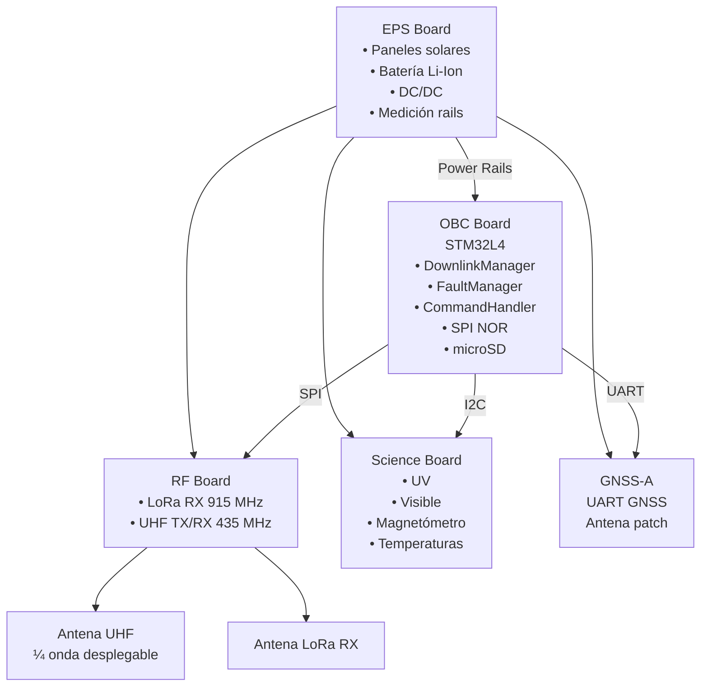
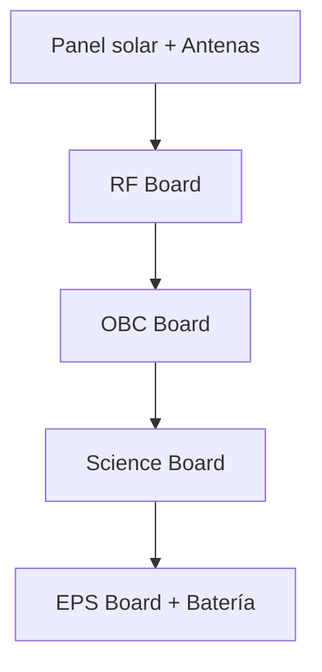

# MVP v1.4 — Block Diagram + ICD

Este documento es un **entregable técnico utilizable directamente** en herramientas **gratuitas online**, alineado y dependiente del documento **MVP** vigente.

Incluye:
1. **Block Diagram lógico y físico** (renderizable)
2. **ICD — Interface Control Document** (eléctrico + lógico)

---

## 1) Block Diagram — Vista lógica de alto nivel

<!-- FEATURE:PHOTO_DEMO START -->

## 1.1) [PHOTO_DEMO] Bloque opcional encapsulado

<!-- FEATURE:PHOTO_DEMO END -->

---

## 2) Block Diagram — Vista física (stack 1.5U)

Notas:
- RF separado del EPS por OBC/SCI para mitigación EMI.
- EPS en la base para manejo térmico.

---

## 3) ICD — Buses y protocolos

### 3.1 Resumen de buses

| Bus | Maestro | Esclavos | Uso |
|----|--------|---------|-----|
| SPI #1 | OBC | RF | LoRa + UHF framing |
| I2C #1 | OBC | Science Board | Sensores |
| UART #1 | OBC | GNSS | Posición / tiempo |
| GPIO | OBC | RF / SCI / EPS | Reset / Enable / Fault |

---

## 4) ICD — OBC ↔ RF Board

| Señal | Tipo | Dirección | Notas |
|-----|-----|-----------|------|
| SPI_MOSI | SPI | OBC → RF | Datos TX |
| SPI_MISO | SPI | RF → OBC | Datos RX |
| SPI_SCK | SPI | OBC → RF | Clock |
| SPI_CS_RF | GPIO | OBC → RF | Chip Select |
| RF_IRQ | GPIO | RF → OBC | RX done / TX done |
| RF_RST | GPIO | OBC → RF | Reset HW |
| 3V3_RF | Power | EPS → RF | Rail aislado |

Interfaz lógica:
- CRC obligatorio.
- Numeración de frames.
- ACK/NACK por UHF.
- Prioridad downlink de housekeeping/comandos sobre tráfico best-effort.

---

## 5) ICD — OBC ↔ Science Board

| Señal | Tipo | Dirección | Notas |
|-----|-----|-----------|------|
| I2C_SDA | I2C | Bidireccional | Bus sensores |
| I2C_SCL | I2C | OBC → SCI | Clock |
| SCI_EN | GPIO | OBC → SCI | Power gate |
| 3V3_SCI | Power | EPS → SCI | Rail dedicado |

---

## 6) ICD — OBC ↔ GNSS

| Señal | Tipo | Dirección | Notas |
|-----|-----|-----------|------|
| UART_TX | UART | OBC → GNSS | Config |
| UART_RX | UART | GNSS → OBC | NMEA |
| GNSS_EN | GPIO | OBC → GNSS | Power gate |

GNSS es **best-effort**, nunca bloqueante.

---

## 7) ICD — EPS ↔ Subsistemas

### Rails
| Rail | Consumo típico | Destino |
|----|---------------|--------|
| VBAT | variable | Reguladores |
| 5V | bajo | GNSS / auxiliares |
| 3V3_OBC | continuo | OBC |
| 3V3_RF | duty | RF |
| 3V3_SCI | duty | Science |

### Señales EPS
| Señal | Dirección | Uso |
|-----|-----------|----|
| PGOOD_x | EPS → OBC | Supervisión por subsistema |
| FAULT_x | EPS → OBC | Fault latched |
| EN_x | OBC → EPS | Habilitación de power-gating |
| VBAT_SENSE | EPS → OBC | Telemetría |

---

## 8) Convenciones obligatorias
- Todos los rails medidos.
- Todos los subsistemas apagables por GPIO.
- Watchdog HW externo obligatorio.
- Ningún subsistema puede impedir SAFE MODE.

---

**Este documento es utilizable como ICD inicial y base de esquemáticos.**
