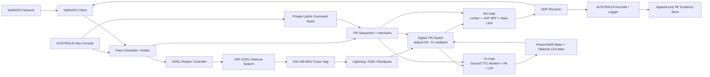

# Dual-Use Ground Station Design - SatNOGS / AUSTRALIS

**Revision:** 2026-07-05
**Estado:** Draft
**Trazabilidad:** `08_Decisions/ADR-20260704-satnogs-public-beacon-private-payload-uplink.md`, `04_Communications/satnogs_public_beacon_architecture.md`, `04_Communications/rf_subsystem_overview.md`

---

## 1) Objetivo

Definir una estacion terrena dual-use para AUSTRALIS-1:

- pre-flight: operar como estacion SatNOGS receive-only y banco de simulacion AUSTRALIS;
- flight: recibir `PUBLIC_BEACON` via SatNOGS y/o pipeline propio;
- flight: recibir `CONTROLLED_DOWNLINK` y transmitir `PRIVATE_UPLINK` solo por stack AUSTRALIS propio;
- mantener SatNOGS fuera de cualquier camino de transmision o control del satelite.

El objetivo de diseno es una estacion terrena con autonomia operativa alta, pero con transmision UHF siempre protegida por licencia, interlocks y procedimientos de seguridad.

---

## 2) Supuestos del sitio

El sitio candidato es una terraza de losa de primer piso, aproximadamente 8 m x 5 m, en barrio de casas bajas del area Buenos Aires.

**Privacidad:** las coordenadas exactas, direccion e imagenes del sitio se omiten intencionalmente de este mirror publico. Deben conservarse fuera del repositorio publico o en anexos privados.

Supuestos iniciales para predimensionamiento:

- altura terraza sobre terreno: **TBD**, asumir 3.5-4.0 m hasta relevamiento;
- entorno: viviendas de 1-2 plantas y arbolado urbano;
- obstaculos cercanos esperables: 8-15 m de altura;
- operacion nominal AUSTRALIS: elevaciones >=20 deg segun mascara UHF vigente;
- SatNOGS: recepcion a elevaciones menores puede ser util, pero <20 deg no debe ser criterio principal de diseno AUSTRALIS.

Estos supuestos no reemplazan relevamiento, calculo estructural ni evaluacion de normativa local.

---

## 3) Arquitectura recomendada

La estacion debe construirse como estacion rotativa UHF direccional desde el inicio. Una estacion minima SatNOGS tipo omni + RTL-SDR sirve para aprendizaje, pero no alcanza como base robusta para TTC privado de AUSTRALIS.

Baseline recomendado:

- antena UHF direccional para 435-438 MHz, preferentemente Yagi/cross-Yagi;
- rotor azimut/elevacion controlable por software;
- path RX con preselector/filtro UHF, proteccion RF y LNA de mastil;
- SDR dedicado para SatNOGS y recepcion publica;
- receptor/decoder AUSTRALIS para `PUBLIC_BEACON` y `CONTROLLED_DOWNLINK`;
- path TX separado logicamente para uplink privado;
- switch T/R digital fail-safe, sin separacion de antenas RX/TX;
- scheduler que arbitre SatNOGS vs ventanas AUSTRALIS;
- estacion meteorologica local para viento, lluvia, temperatura, humedad y presion;
- UPS, watchdogs, telemetria local, control remoto y park automatico por clima/falla.

No se recomienda separar antenas para RX y TX en esta etapa. La decision de diseno es una sola antena UHF compartida, con conmutacion/proteccion RF.

---

## 4) Diagrama logico base



Regla de seguridad: SatNOGS puede controlar observaciones receive-only y, como maximo, compartir rotor/receptor. SatNOGS no debe tener credenciales, GPIO, PTT ni acceso de software al transmisor.

---

## 5) Modos de operacion

### `MODE_SATNOGS_RX`

- Estacion registrada en SatNOGS.
- SatNOGS Client agenda observaciones receive-only.
- Rotor y SDR operan segun SatNOGS.
- T/R switch queda en RX.
- PA, modem TX y PTT quedan desenergizados/inhibidos.

### `MODE_AUSTRALIS_PUBLIC_RX`

- Recepcion del `PUBLIC_BEACON` con pipeline AUSTRALIS.
- Puede convivir con SatNOGS si el schedule no entra en conflicto.
- Evidencia guardada localmente con raw IQ/audio/frame logs.

### `MODE_AUSTRALIS_CONTROLLED_RX`

- Downlink controlado: `PHOTO_DEMO`, performance IA, `AI_BEHAVIOR_LOG` detallado, `SCIENCE`, `LORA_LOG` y dumps.
- SatNOGS puede quedar deshabilitado durante la ventana.
- Decoder y storage son propios, no publicos por defecto.

### `MODE_AUSTRALIS_PRIVATE_TX_ARMED`

- Uplink privado/controlado.
- Requiere operador/criterio de licencia, ventana planificada, TLE vigente, rotor tracking, potencia/SWR dentro de limites e interlocks activos.
- SatNOGS queda bloqueado en esa ventana.
- Al terminar, la estacion vuelve automaticamente a RX y libera la ventana si corresponde.

### `MODE_MAINTENANCE`

- Pruebas locales de rotor, SDR, RF switch, dummy load, calibracion de potencia, simuladores y actualizaciones.
- TX radiado solo si esta permitido por licencia/procedimiento. Preferir pruebas por coax + atenuadores + dummy load.

---

## 6) Switch T/R, duplexer y circulator

Requisito del diseno: no usar antenas separadas RX/TX. La proteccion se resuelve con conmutacion y/o componentes RF en una cadena compartida.

### Decision preliminar

Baseline recomendado: **switch T/R digital + secuenciador fail-safe**, con circulator opcional en el path TX.

Motivos:

- el enlace AUSTRALIS UHF es half-duplex por plan operativo;
- el LNA/SDR debe quedar fisicamente protegido durante TX;
- SatNOGS no debe poder activar transmision;
- un duplexer solo tiene sentido si se definen frecuencias RX/TX suficientemente separadas o full-duplex real;
- un circulator protege PA y mejora aislacion, pero no reemplaza por si solo un T/R switch con interlocks.

### Secuencia minima de TX

1. Bloquear SatNOGS y cualquier observacion RX concurrente.
2. Validar ventana, elevacion, TLE, viento, rotor, licencia/procedimiento y operador/armado.
3. Deshabilitar bias del LNA y aislar receptor.
4. Conmutar T/R a TX.
5. Verificar estado de relays/switches.
6. Habilitar modem/PA y PTT.
7. Transmitir.
8. Deshabilitar PTT/PA.
9. Conmutar T/R a RX.
10. Rehabilitar LNA/SDR.
11. Guardar log de uplink, potencia, SWR, comandos y resultado.

### Interlocks minimos

- default fisico en RX y TX deshabilitado;
- llave logica `TX_ARM` separada del PTT;
- watchdog que corta PTT ante perdida de control;
- medicion de potencia directa/reflejada;
- limite de SWR;
- limite de duracion de TX por ventana;
- bloqueo de TX si el rotor no esta trackeando;
- bloqueo de TX fuera de frecuencia/servicio autorizado;
- E-stop local;
- registro append-only de cada intento de TX.

---

## 7) Linea de transmision

La linea de transmision debe disenar primero para bajas perdidas en UHF y segundo para servicio exterior permanente.

Recomendacion inicial:

- usar coaxial clase LMR-400 / Ecoflex 10 / Hyperflex 10 o mejor para corridas hasta ~25 m;
- evaluar LMR-600 o hardline 1/2 in si la corrida supera ~25-30 m o si se busca margen TX adicional;
- evitar RG-58 para la linea principal;
- conectores N-type en exterior; pigtails cortos a SMA/BNC solo dentro de gabinete;
- arrestor coaxial en punto de entrada al edificio;
- puesta a tierra comun de torre, rotor, gabinete RF y protectores;
- drip loops, alivio mecanico, cinta autofusionante y cubierta UV;
- loop de servicio suficiente para movimiento AZ/EL sin fatiga del coax;
- cables de rotor/control separados fisicamente de RF cuando sea posible.

Perdidas orientativas a 435 MHz para 20 m:

| Cable | Perdida tipica | Comentario |
|---|---:|---|
| RG-58 | ~5-6 dB | No recomendado para linea principal UHF |
| RG-213 | ~2.5-3 dB | Usable, pero penaliza TX/RX |
| LMR-400 class | ~1.2-1.6 dB | Recomendado como baseline |
| LMR-600 / hardline 1/2 in | ~0.7-1.0 dB | Mejor margen, mas rigido/caro |

Si el LNA va en mastil, la perdida RX despues del LNA duele menos. La perdida TX sigue importando: 3 dB de coax reducen a la mitad la potencia radiada disponible.

---

## 8) Torre y altura recomendada

### Criterio de altura

Para despejar un obstaculo a una elevacion minima `E_min`:

```text
h_mast >= H_obs - H_roof - D * tan(E_min)
```

Donde:

- `h_mast`: altura del centro de fase de la antena sobre la terraza;
- `H_obs`: altura del obstaculo sobre terreno;
- `H_roof`: altura de terraza sobre terreno;
- `D`: distancia horizontal al obstaculo;
- `E_min`: elevacion minima deseada.

Ejemplos con `H_roof = 3.5 m`:

| Obstaculo | Distancia | Para 20 deg | Para 10 deg |
|---|---:|---:|---:|
| 12 m | 20 m | ~1.2 m | ~5.0 m |
| 15 m | 20 m | ~4.2 m | ~8.0 m |
| 15 m | 30 m | ~0.6 m | ~6.2 m |

Lectura:

- Para AUSTRALIS nominal >=20 deg, una antena con centro de fase ~4.5-5 m sobre terraza deberia ser suficiente frente a casas bajas y muchos obstaculos urbanos.
- Para perseguir recepcion confiable a 10 deg sobre arboles cercanos de 12-15 m, la torre podria necesitar 6-8 m sobre terraza, con salto fuerte de complejidad estructural y viento.

### Recomendacion inicial

Construir fase 1 con centro de fase de antena a **~5 m sobre terraza**.

Implementacion probable:

- torre/mastil liviano de 4-5 m sobre la losa;
- base anclada a estructura portante, no solo a carpeta/losa superficial;
- 3 o 4 riendas si el diseno lo requiere;
- rotor AZ/EL en el extremo superior;
- crossboom y antena con radio de giro libre;
- reserva mecanica para subir a ~6 m solo si el calculo estructural lo aprueba.

No se recomienda ir directo a 7-8 m sobre terraza sin calculo estructural profesional, verificacion de viento, anclajes y bajada a tierra.

### Tipo de soporte

Preferencia:

1. Torre triangular liviana o mastil estructural con base y riendas, apto intemperie.
2. Tripode/mastil reforzado solo si el conjunto queda por debajo de ~4-5 m y el fabricante lo permite.
3. Evitar mastiles de TV livianos no especificados para rotor AZ/EL y carga lateral de Yagi.

La torre debe quedar cerca del centro util de la terraza para maximizar despeje, permitir radio de giro y distribuir riendas/anclajes. La terraza 8 m x 5 m parece viable para una instalacion compacta, pero debe confirmarse con relevamiento real de columnas, vigas, parapetos, desagues y acceso.

---

## 9) Masa, dimensiones y cargas preliminares

Predimensionamiento del conjunto superior:

| Bloque | Dimension / masa preliminar |
|---|---|
| UHF cross-Yagi 435 MHz | boom ~1.5-2.5 m, 2-5 kg |
| Crossboom + clamps | ~1-2 m, 2-5 kg |
| Rotor AZ/EL comercial | ~8-18 kg con soportes, segun modelo |
| Gabinete RF mastil | 2-5 kg |
| Coax loops / cables | 1-3 kg en cabeza |
| Masa rotante estimada | ~15-30 kg |
| Masa cabeza completa | ~20-35 kg |
| Torre/mastil 4-6 m | ~35-100 kg, segun perfil |

La carga critica no es solo el peso estatico: es el momento por viento sobre antena, rotor, mastil y cables. El calculo final debe considerar:

- velocidad de viento local de diseno;
- area proyectada de antena y rotor;
- momento en base de torre;
- resistencia de anclajes;
- punzonamiento/estado de losa;
- camino de cargas hacia vigas/columnas;
- corrosion y fatiga por movimiento.

---

## 10) Autonomia de estacion

Autonomia minima objetivo:

- SatNOGS Client con scheduler automatico;
- AUSTRALIS pass scheduler con prioridad sobre SatNOGS para ventanas propias;
- NTP + GNSS o fuente de tiempo redundante;
- actualizacion TLE automatica con cache local;
- rotator watchdog y park automatico;
- estacion meteorologica local con anemometro, direccion de viento, lluvia, temperatura exterior, humedad exterior, presion, temperatura interior de gabinete y humedad interior;
- UPS para miniPC/RPi, red, rotator controller y control RF;
- PDU o relays para power-cycle remoto;
- VPN/SSH seguro;
- camara local opcional para verificar posicion/entorno;
- logging append-only de IQ/audio, frames, comandos, potencia/SWR, rotor, clima, ambiente interior de gabinete y errores;
- backups automaticos de evidencia de pasadas.

Para `PRIVATE_UPLINK`, la autonomia debe estar limitada por una politica de armado. La estacion puede preparar ventanas y validar interlocks automaticamente, pero el permiso de transmitir debe responder a licencia, procedimiento y autorizacion operacional definida.

---

## 10.1) Estacion meteorologica local

La estacion terrena debe incluir instrumentacion meteorologica propia. No debe depender solo de reportes de clima externos porque el viento, lluvia y humedad relevantes son los del mastil y del gabinete.

Sensores minimos:

- anemometro para velocidad de viento;
- veleta o estimacion de direccion de viento;
- sensor de lluvia o superficie humeda;
- temperatura exterior;
- humedad exterior;
- presion barometrica;
- temperatura interior del gabinete electronico;
- humedad interior del gabinete electronico.

Sensores recomendados:

- sensor de apertura de gabinete;
- sensor de inundacion/agua en base estanca;
- sensor de corriente y tension PoE/DC interna;
- heater o elemento anti-condensacion controlado por humedad interior;
- respiradero hidrofobico para compensacion de presion y humedad.

Uso operacional:

- inhibir tracking si el viento excede el limite operativo definido;
- ordenar park automatico si el viento supera el limite de seguridad o hay lluvia intensa;
- bloquear cualquier TX radiado si viento, lluvia, humedad interior o temperatura de gabinete estan fuera de limites;
- registrar condiciones ambientales junto con cada observacion SatNOGS/AUSTRALIS;
- disparar alerta si sube la humedad interior, si aparece agua en base o si la temperatura interior excede margen de SDR/RPi.

Limites preliminares para diseno RX-only:

| Condicion | Accion preliminar |
|---|---|
| Viento <=10 m/s | Tracking normal |
| Viento 10-15 m/s | Tracking permitido con monitoreo |
| Viento >15 m/s | Inhibir nuevas pasadas y park |
| Viento >20 m/s | Park obligatorio / no tracking |
| Lluvia intensa | Inhibir mantenimiento exterior y revisar ruido RF |
| Humedad interior alta o condensacion | Alertar, activar mitigacion y evitar operacion desatendida |

Estos limites son placeholders de ingenieria. Deben ajustarse cuando se conozcan masa, area proyectada, torque real, rigidez de mastil y especificaciones de antena/rotor.

---

## 11) Pre-flight: SatNOGS y simulacion AUSTRALIS

Durante pre-flight:

1. Operar UHF SatNOGS con satelites existentes para validar antena, rotor, LNA, SDR, ruido local y persistencia.
2. Ejecutar "shadow passes" AUSTRALIS: el rotor sigue pasadas reales o simuladas mientras el stack AUSTRALIS procesa datos sinteticos.
3. Probar beacon AUSTRALIS por coax con atenuadores/dummy load o en caja RF, evitando radiacion no autorizada.
4. Validar decoder `PUBLIC_BEACON` y storage con capturas reproducibles.
5. Probar el ground TTC modem/OpenLST-derived en loop cerrado antes de cualquier TX radiado.
6. Ensayar T/R switch, secuenciador y fallas: perdida de control, SWR alto, LNA bias activo, rotor fuera de tracking, watchdog timeout.

Objetivo de salida pre-flight: estacion probada como SatNOGS receive-only y como banco end-to-end de AUSTRALIS sin depender de que el satelite exista aun.

---

## 12) Plan de fases

### Fase 0 - Relevamiento

- Relevar terraza, altura real, entorno, line-of-sight por azimut, ubicacion de shack, recorrido de coax y puesta a tierra.
- Medir ruido UHF local con SDR.
- Definir ubicacion del modulo meteorologico, ruta de cableado, exposicion de anemometro/veleta y punto de medicion interior del gabinete.
- Confirmar estructura portante con profesional.

### Fase 1 - SatNOGS RX direccional

- Montar torre/mastil y rotor.
- Instalar UHF cross-Yagi, LNA, filtro y SDR.
- Instalar estacion meteorologica local e integrar viento/lluvia/ambiente interior con park automatico.
- Integrar SatNOGS Client.
- Registrar observaciones y ruido por al menos varias semanas.

### Fase 2 - AUSTRALIS RX/Decoder

- Agregar decoder AUSTRALIS y evidencia append-only.
- Probar `PUBLIC_BEACON` por coax/simulador.
- Preparar paquete SatNOGS DB cuando el transmisor de vuelo este definido.

### Fase 3 - TX privado controlado

- Agregar modem TTC, PA, filtro, medicion de potencia/SWR, T/R switch digital y secuenciador.
- Probar solo en dummy load/coax hasta tener autorizacion/procedimiento.
- Validar interlocks y logs.

### Fase 4 - Operacion orbital

- SatNOGS para `PUBLIC_BEACON` receive-only.
- AUSTRALIS para `CONTROLLED_DOWNLINK` y `PRIVATE_UPLINK`.
- Ventanas AUSTRALIS preemptan SatNOGS cuando haya conflicto.

---

## 13) Riesgos abiertos

- altura insuficiente para recepcion <20 deg si hay arboles cercanos;
- sobrecarga por viento o anclaje inadecuado;
- medicion meteorologica local ausente, mal ubicada o no integrada a park/inhibiciones;
- perdida TX por coax si la linea es larga o cable inadecuado;
- dano de LNA/SDR por secuencia TX incorrecta;
- TX accidental desde software SatNOGS o sistema no autorizado;
- ruido urbano UHF no caracterizado;
- condensacion o humedad interior en gabinete electronico;
- falta de cierre regulatorio para uplink y downlink controlado.

Mitigaciones:

- empezar con centro de fase ~5 m sobre terraza y mascara nominal >=20 deg;
- medir ruido y desempeno real antes de subir altura;
- integrar anemometro/lluvia/ambiente interior como interlocks y evidencia de pasada;
- usar switch T/R fail-safe con interlocks;
- usar coax de baja perdida y puesta a tierra correcta;
- bloquear SatNOGS fuera de cualquier control TX;
- tratar cifrado/privacidad y uplink como cierre regulatorio separado.

---

## 14) BOM candidates - local procurement scan

These candidates are tracked in `06_Costs/BOM_master.csv` under `Ground Segment / EGSE`.

MercadoLibre pages may change and may require account verification. Treat all seller specs as unverified until photos, datasheets, connector type, dimensions and return terms are confirmed.

### SDR and RF computing candidates

| BOM role | Candidate | Fit | Recommendation |
|---|---|---|---|
| SatNOGS / `PUBLIC_BEACON` RX | RTL-SDR Blog V4 receiver | RX-only, low cost, widely documented, SatNOGS-friendly with the correct RTL-SDR v4 driver. | Preferred Phase 1 RX candidate if genuine. Use with UHF filter, mast LNA and good USB/RFI hygiene. |
| SatNOGS / `PUBLIC_BEACON` RX alternate | Nooelec NESDR SMArt v5 / RTL-SDR premium metal | RX-only, metal case, TCXO class receiver, UHF 435 MHz coverage. | Good alternate to RTL-SDR Blog V4 if genuine and Linux/SatNOGS driver support is confirmed. |
| AUSTRALIS modem development | PlutoSDR Zynq7010 AD9363 transceiver | SDR TX/RX platform, suitable for GNU Radio/libiio experiments around UHF. | Use as Phase 2 lab/development transceiver for controlled downlink/uplink waveforms. Do not expose it to SatNOGS or to an unattended TX path. |

Candidate links:

- RTL-SDR Blog V4 class: https://www.mercadolibre.com.ar/nuevo-rtl-sdr-v4-hf-receptor-recibe-80m-40m-20m-10m-2m-rtl/up/MLAU120437591
- Nooelec / RTL-SDR premium metal class: https://www.mercadolibre.com.ar/radio-sdr-premium-hf-vhf-uhf-100khz-1-75ghz-sma-metal/up/MLAU4009654843
- PlutoSDR Zynq7010 AD9363 class: https://www.mercadolibre.com.ar/pluto-sdr-zynq7010-ad9363-transceptor-de-radio-de-doble/up/MLAU4223612216

Selection notes:

- The station should keep a **dedicated RX-only SDR** for SatNOGS. This reduces accidental TX risk and makes the public receive path replaceable.
- PlutoSDR is attractive for AUSTRALIS modem development, but it is not a complete ground TTC radio by itself. It still needs PA, filters, power/SWR metering, T/R switching, attenuators/dummy loads, reference/stability checks and regulatory closure.
- Any SDR selected for permanent station use must be validated with `SoapySDRUtil`, SatNOGS Client, Linux service boot, thermal soak and several weeks of UHF observations.

### Tower / mast candidate

Candidate:

- Hot-dip galvanized steel column: https://www.mercadolibre.com.ar/columnas-de-hierro-galvanizadas-en-caliente/up/MLAU262760109

Compatibility reading:

- A galvanized steel column can be useful as a mast/support element, but it is **not accepted as a tower baseline** until mechanical details are known.
- Required data before adoption: total height, tube/column profile, wall thickness, diameter at base/top, mass, base plate geometry, anchor bolt pattern, material grade, galvanizing standard, allowable lateral load, wind rating and whether it supports a top-mounted AZ/EL rotor with cross-Yagi wind load.
- If it is a lighting/fence column without published wind/moment data, treat it as a procurement candidate only. The baseline remains a light triangular tower or structural mast designed for antenna service, with professional review of roof anchors and load path.
- For the current 5 m center-of-phase target, the best path is a support that allows guying, grounding and safe service access without overloading the roof slab.

### Coaxial line candidate

Candidate:

- LMR-400 x 10 m VHF/UHF coax: https://www.mercadolibre.com.ar/cable-coaxil-lmr-400-x-10-metros-rf-radioaficionados-vhfuhf/up/MLAU3956799499

Compatibility reading:

- This is compatible with the baseline if it is true 50 ohm LMR-400-class cable and the real station run is near 10 m.
- Expected loss at 435 MHz for 10 m is roughly **0.8-1.0 dB**, before connector/adaptor losses.
- Confirm connector type before buying. Exterior RF runs should prefer N-type weatherproof connectors. SMA should remain inside the RF cabinet as short pigtails.
- Confirm jacket UV rating, minimum bend radius, shielding quality, strain relief and whether the cable is flexible enough for the rotor service loop.
- If the final route exceeds ~20-25 m, re-evaluate LMR-600 / hardline 1/2 in or moving the RF box closer to the mast.

Procurement priority for Phase 1:

1. Genuine RTL-SDR Blog V4 or Nooelec NESDR SMArt v5 for RX-only SatNOGS validation.
2. LMR-400-class coax only after measuring the real route and connector plan.
3. Tower/mast only after structural details and roof anchor path are confirmed.
4. PlutoSDR for AUSTRALIS modem development after the receive station is stable, or earlier only as bench equipment.

### Weather / environment candidates

Required BOM roles:

| BOM role | Candidate class | Fit | Recommendation |
|---|---|---|---|
| Wind safety | Outdoor anemometer + wind direction sensor | Provides local mast-level wind for tracking inhibit and park logic. | Required for autonomous operation. Prefer pulse/RS485/Modbus output with documented calibration. |
| Rain / wet surface | Outdoor rain sensor or tipping-bucket rain gauge | Detects unsafe maintenance/weather conditions and correlates RF noise/observations. | Required for unattended station; avoid exposed cheap PCB-only rain plates as sole safety sensor. |
| Outdoor environment | Temperature / humidity / pressure sensor in shielded enclosure | Records local weather context for passes. | Use radiation shield and avoid direct sun/heated surfaces. |
| Cabinet environment | Internal temperature / humidity sensor | Detects condensation and thermal stress in SDR/RPi/PoE electronics. | Required for sealed dome/base design. Add hydrophobic vent and optional anti-condensation heater if needed. |
| Power telemetry | PoE/DC voltage and current monitor | Detects brownout, motor stalls and heater load. | Recommended for root-cause analysis and remote maintenance. |

Selection notes:

- Weather data is part of the station evidence record, not just a dashboard feature.
- Wind and rain must feed the rotator/scheduler interlock path, not only a web UI.
- Cabinet humidity should alarm before condensation appears on SDR, Pi, RF connectors or motor drivers.
- Sensor location matters: an anemometer hidden behind parapets is not valid for park/inhibit decisions.

---

## 15) Referencias externas

- SatNOGS Ground Stations: https://wiki.satnogs.org/Ground_Stations
- SatNOGS Main Page: https://wiki.satnogs.org/Main_Page
- SatNOGS Introduction: https://wiki.satnogs.org/Introduction
